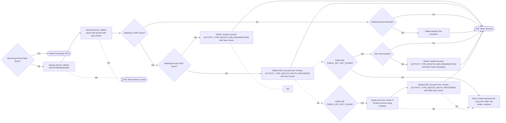

import { MainFactor } from "/snippets/backup/terms.mdx";

## BF-7. Factor Deletion
- This flow is triggered when the user deletes a <MainFactor /> from the UI.
- Sync Factors are not manually removed by the user. This is usually done through other flows (e.g. when logging out).
- Currently, Passkeys are enrolled into Turnkey to provide a fallback mechanism in case a Sync Factor is no longer available. When the requested operation cannot be completed with the Sync Factor (see `PUBLIC_KEY_NOT_FOUND` error), the client will use the Passkey to execute the operation instead.
- **Future Note**: The current flow assumes that Turnkey is only used for OIDC Factors. This may change in the future (e.g. to support non-PRF Passkeys).

