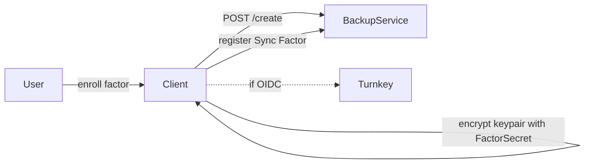
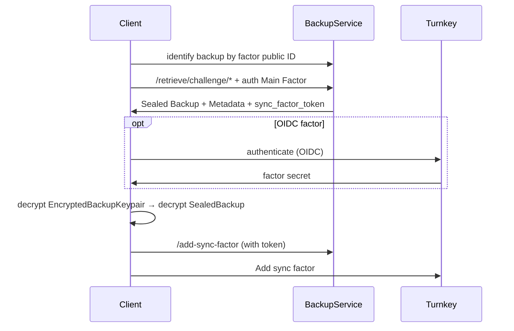

import { MainFactor, SyncFactor, BackupEncryptionKeypair, FactorSecret, SealedBackup, BackupMetadata, EncryptedBackupEncryptionKeypair } from "/snippets/backup/terms.mdx";

# Conventions

The flows are numbered (BF-1, BF-2, …) and referenced from code and other docs. Each section below covers **purpose, what's non-obvious, and where the iOS and Android implementations diverge** — not a step-by-step script. The authoritative sequencing lives in the client code; this page exists to explain *why* a flow looks the way it does.

# BF-1: Backup Creation

**When.** A user finishes onboarding and creates their first backup, picking one or two recovery methods.

**Non-obvious.** The client generates a *fresh* <BackupEncryptionKeypair /> at this moment, encrypts the <SealedBackup />, encrypts the keypair with the <FactorSecret /> of each enrolled <MainFactor />, and then **discards the keypair's secret**. Only the public key is retained locally so subsequent sync operations can re-encrypt new <SealedBackup />s without authenticating a Main Factor. This is what makes background sync (BF-4) possible.

A <SyncFactor /> is also generated at creation and registered with the Backup Service in the same `/create` call, so the device is immediately authorized to push updates.

**OIDC + Passkey one-tap enrollment.** When the user enrolls both a Passkey and an OIDC factor (Google/Apple) at creation, the client takes advantage of a *merged Turnkey passkey challenge*: the Passkey signs both a Backup Service challenge and a Turnkey activity stamp in a single user gesture. This is also the pattern used in BF-3 when adding an OIDC factor to an existing Passkey-only account.

**Cross-platform.** iOS and Android diverge only in the platform-specific factor enrollment (Passkey ceremony, OIDC sign-in SDK). The Bedrock-side sealing and backup-service interaction are identical.

```mermaid
flowchart LR
    User -->|enroll factor| Client
    Client -->|generate BackupEncryptionKeypair| Client
    Client -->|seal backup| Client
    Client -->|encrypt keypair with FactorSecret| Client
    Client -->|POST /create| BackupService
    Client -->|register Sync Factor| BackupService
    Client -.->|if OIDC| Turnkey
```

# BF-2: Backup Retrieval

**When.** A user signs into World App on a new device.

**Non-obvious.** Retrieval (or previously "Recovery") is the most architecturally distinct flow because the user has no local state. The client has to bootstrap from a single Main Factor.

The client identifies the backup by presenting the Main Factor's *public identifier* (passkey credential ID, OIDC `sub`, or Keychain public key) — the Backup Service has a reverse lookup table that maps these to a `backup_id`. Once the backup is located, the user authenticates the factor and the Backup Service returns the <SealedBackup /> together with the metadata.

After the backup is decrypted, the client generates a fresh <SyncFactor /> for the new device and registers it via `/add-sync-factor`. This call uses a short-lived `sync_factor_token` issued by `/retrieve/from-challenge`, which lets the client add the new device authorization without re-prompting for a Main Factor.

**OIDC recovery quirk.** For OIDC factors, decrypting the <BackupEncryptionKeypair /> requires the <FactorSecret /> held by Turnkey. The user authenticates to Turnkey via OIDC; Turnkey's enclave verifies the OIDC token *and the user's identity* before exporting the secret to the client. This is why OIDC recovery requires a network round-trip beyond the one to the Backup Service.

```mermaid
sequenceDiagram
    participant Client
    participant BackupService
    participant Turnkey
    Client->>BackupService: identify backup by factor public ID
    Client->>BackupService: /retrieve/challenge/* + auth Main Factor
    BackupService->>Client: Sealed Backup + Metadata + sync_factor_token
    opt OIDC factor
        Client->>Turnkey: authenticate (OIDC)
        Turnkey->>Client: factor secret
    end
    Client->>Client: decrypt EncryptedBackupKeypair → decrypt SealedBackup
    Client->>BackupService: /add-sync-factor (with token)
    Client->>Turnkey: Add sync factor
```

# BF-3: Adding a Main Factor

**When.** A user adds a second (or third) recovery method from Settings.

**Non-obvious.** Adding a factor *does not* require re-encrypting the entire backup. The client only needs to encrypt the existing <BackupEncryptionKeypair /> with the new <FactorSecret /> and append the resulting <EncryptedBackupEncryptionKeypair /> to the metadata. This is the entire point of the keypair indirection layer (see [Layered Encryption Model](/world-app/backup/index#layered-encryption-model)).

To add an OIDC factor with a Passkey already enrolled, the merged Turnkey passkey challenge from BF-1 is reused — one passkey tap authorizes both `/add-factor` on the Backup Service and the Turnkey activity that creates the OIDC provider.

**Currently disabled.** Adding a Passkey when an OIDC factor exists is *not* supported today. Removing a Passkey while an OIDC factor exists is also not supported, because the Passkey is the fallback path for Turnkey when the Sync Factor's Turnkey credentials are no longer valid (see [Unauthorized Device](/world-app/backup/advanced#unauthorized-device)).

# BF-4: Backup Sync

**When.** The user takes an action that produces a new file (e.g., orb verification yields a new PCP) or modifies the credential vault.

**Non-obvious.** Sync runs silently — it only uses the <SyncFactor />, not a <MainFactor />. The client retains the public half of the <BackupEncryptionKeypair /> from creation/recovery, which is enough to re-encrypt the new <SealedBackup /> without unlocking any factor secret.

The flow is gated by the manifest hash. If the local manifest is stale (the user updated their backup on another device), the sync attempt fails with `manifest_hash_mismatch` and the UI escalates to BF-5.

# BF-5: Remote-Update Detection

**When.** App launch, and on demand from sync failures.

**Non-obvious.** This is the only flow that prompts re-authentication of a Main Factor *outside* of explicit user intent. Because background sync cannot fetch encrypted backup contents (the <SyncFactor /> can't decrypt), reconciling a remote update requires a Main Factor.

The client simply fetches the remote manifest hash; if it doesn't match the local hash, the UI presents a recovery-style prompt and the user re-authenticates a Main Factor to download the updated backup. After download, local sync resumes normally.

# BF-6: Multi-Device Sync

This is not a separate flow but a consequence of BF-4 and BF-5 interacting. See [Advanced Topics — Multiple Device Sync](/world-app/backup/advanced#multiple-device-sync).

# BF-7: Factor Deletion

**When.** The user removes a recovery method from Settings.

**Non-obvious.** Two systems need updating: the Backup Service (remove from <BackupMetadata />) and Turnkey (remove the corresponding OIDC provider, or delete the sub-organization if it's the last OIDC factor). Both deletions happen using the <SyncFactor />, not a Main Factor — Turnkey policy explicitly authorizes the Sync Factor for these specific deletion activities (see [Components & Parties — Turnkey](/world-app/backup/components#turnkey)). This avoids a passkey prompt on every Settings interaction.

**Failure handling.** If the Sync Factor is no longer valid in Turnkey (`PUBLIC_KEY_NOT_FOUND` — see [Unauthorized Device](/world-app/backup/advanced#unauthorized-device)), the client falls back to the user's Passkey to perform the Turnkey operation. This is one of the reasons a Passkey is currently required to manage other factors.

**Last factor.** Deleting the last <MainFactor /> cascades into BF-8.

# BF-8: Backup Deletion

**When.** The user removes their last <MainFactor />, or initiates full account deletion in World App.

**Non-obvious.** Deletion clears state across three places — the Backup Service (metadata + sealed blob + factor lookup), Turnkey (entire sub-organization, if one exists), and local device (Sync Factor keypair, plus the iCloud Keychain factor on iOS). All three deletions are issued from the client with retries; failures are logged but do not block the user-visible "deleted" outcome, because the Backup Service's deletion is authoritative.

# BF-9: Disaster Recovery via /reset

**When.** The user has lost every <MainFactor /> and every <SyncFactor /> but still controls the original device (and therefore the Root Key). This is the last-resort path; see [Disaster Recovery via /reset](/world-app/backup/advanced#disaster-recovery-via-reset) for the full rationale and preconditions.

**Non-obvious.** This is a destructive *wipe*, not a recovery of backup contents. This process clears the backup so the user can re-enroll from scratch. Its authorized by the deterministic backup-account `secp256k1` key the user reproduces locally, so nothing here depends on a Main or Sync Factor:

1. The Backup Service `/reset` deletes the metadata, sealed blob, and factor-lookup entries. This deletion is authoritative.
2. The Turnkey sub-organization is torn down. The client submits a `deleteSubOrganization` activity stamped with the backup-account key acting as the `break_glass_user`.
