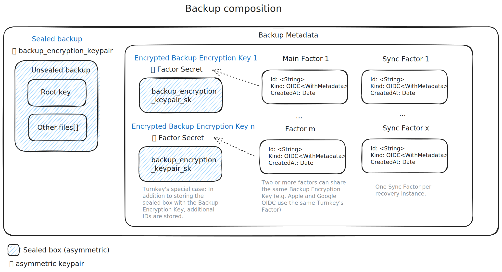

import { UnsealedBackup, BackupEncryptionKeypair, EncryptedBackupEncryptionKeypair, BackupMetadata, MainFactor, SealedBackup, SyncFactor } from "/snippets/backup/terms.mdx";

[turnkey]: https://turnkey.com/

# Introduction

Introduction and high-level context coming soon.

# Technical Reference

## High-Level Overview
Coming soon.

## Backup Composition

- The <UnsealedBackup /> is a collection of raw files. It is stored locally only on-device.
- The user encrypts the <UnsealedBackup /> with a <BackupEncryptionKeypair /> that's randomly generated by World App.
- The user then encrypts the <BackupEncryptionKeypair /> with each _Factor Secret_, creating $n$ <EncryptedBackupEncryptionKeypair />. After the <BackupEncryptionKeypair /> is encrypted with each _Factor Secret_, the user discards the secret key of the <BackupEncryptionKeypair />, and stores the public key (which is used to encrypt new versions of the <UnsealedBackup /> to **Sync** the backup).
- All the <EncryptedBackupEncryptionKeypair />s are stored in the <BackupMetadata />.

<Note>The reason for the <BackupEncryptionKeypair /> layer is that when adding a new <MainFactor />, the factor can be added without requiring to create a new <SealedBackup />. If _Factor Secrets_ were used directly, $n$ versions of the <SealedBackup /> would need to be stored.</Note>

### Factor Secrets
Main Factors are able to derive or store _Factor Secrets_. A _Factor Secret_ is a symmetric key that is used to encrypt the <BackupEncryptionKeypair />. When decrypting the <SealedBackup />, the <BackupEncryptionKeypair /> is decrypted first with the _Factor Secret_ and then the Sealed Backup to retrieve the raw files. Each <MainFactor /> derives its _Factor Secret_ this way:

- For Passkeys, the _Factor Secret_ is a [PRF extension key](https://www.w3.org/TR/webauthn-3/#prf-extension) which allows deriving a deterministic symmetric key.
- For OIDC, the _Factor Secret_ is a random 32 byte sequence that is generated in the user's World App and then stored inside [Turnkey][turnkey]'s Secure Enclaves as a _Private Key_. On recovery, the Secure Enclave provably authenticates the user before providing the secret.
- For iCloud Keychain, a P-256 keypair is generated by the `Security` framework on iOS and stored in the keychain. The private key is used as a secret to encrypt the <BackupEncryptionKeypair />.

### Backup Metadata

The <BackupMetadata /> is a plain-text file that is stored in the backup service. It generally contains the following information (see [source code](https://github.com/worldcoin/backup-service/blob/main/src/types/backup_metadata.rs) for most up-to-date information):
- The ID of the backup
- The list of <EncryptedBackupEncryptionKeypair />.
- The list of <MainFactor />s.
- The list of <SyncFactor />s.