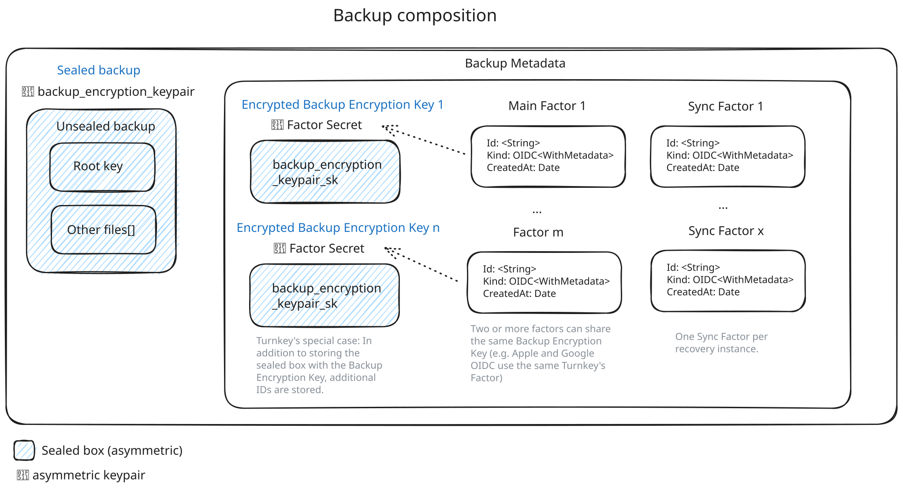

import { UnsealedBackup, BackupEncryptionKeypair, EncryptedBackupEncryptionKeypair, BackupMetadata, MainFactor, SealedBackup, SyncFactor, FactorSecret } from "/snippets/backup/terms.mdx";
import { RootKey, PersonalCustodyPackage } from "/snippets/terms.mdx";

# Introduction

World App is self-custodial: the user's [Root Key](/world-app/cryptography), wallet, World ID, etc. all live on their device. Backup & Recovery is what lets the user re-derive that state on a new device when the old one is lost/replaced without trusting any single party with the plaintext data. This system is particularly designed with distributed trust where no single party can compromise a user's backup, in essence the _lock_ and _key_ are handled by independent parties and hardened independently.

The backup is end-to-end encrypted on the client, stored as ciphertext by the **Backup Service**, and decryptable only with one of the user's enrolled <MainFactor />s (Passkey, OIDC account, iCloud Keychain keypair).

# System Overview

There are four main components involved in the system.

- **Client (iOS, Android)**: User-facing flows. Implements platform-specific factor logic and calls into Bedrock for shared crypto and manifest logic.
- **[Bedrock](/world-app/bedrock)**: Cross-platform library shared by both clients. Owns the backup file format, manifest computation, sealing/unsealing, and the Turnkey stamping primitives. See [`bedrock`](https://github.com/worldcoin/bedrock/tree/main/bedrock/src/backup).
- **Backup Service**: A secure backend storage layer which holds the <SealedBackup /> and <BackupMetadata />, validates state transitions on sync, and exposes endpoints for factor management. It never sees the decrypted plain text, nor has it any way of accessing the ciphertext. The keys with which the ciphertext is encrypted are never seen by this service. See [`backup-service`](https://github.com/worldcoin/backup-service). Currently this service is operated independently by [Nethermind](https://www.nethermind.io/).
- **[Turnkey][turnkey]** — Holds <FactorSecret />s for OIDC factors inside its Trusted Execution Environment (TEE on AWS Nitro) and provably authenticates the user (via OIDC). Internally, TFH is the parent organization; each user is a sub-organization. Neither TFH or Turnkey can access the user's secrets, this is enforced by the TEE.

The Client orchestrates everything; the Backup Service is intentionally narrow.

# Layered Encryption Model

The backup uses two layers of asymmetric encryption rather than a single password-derived key. This decouples factor lifecycle from backup content.

- The <UnsealedBackup /> is the plaintext: a collection of files (the <RootKey />, PCPs, the credential vault) plus a manifest. Its structure is owned by Bedrock's `BackupFormat`. See [Backup Structure & Sync](/world-app/backup/structure-and-sync).
- The client encrypts the <UnsealedBackup /> with a <BackupEncryptionKeypair /> randomly generated at backup creation. The result is the <SealedBackup />.
- The client then encrypts the <BackupEncryptionKeypair /> once per <MainFactor /> with that factor's <FactorSecret />, producing $n$ <EncryptedBackupEncryptionKeypair />s. The keypair's secret key is then **discarded** — only the public key is kept locally so the client can re-encrypt new versions of the backup without authenticating a Main Factor.
- The <EncryptedBackupEncryptionKeypair />s live in the <BackupMetadata /> alongside the list of factors.

<Note>The reason for the keypair indirection is that adding a new <MainFactor /> only requires re-encrypting the keypair (small) under the new <FactorSecret />, not the entire backup. Without it, $n$ copies of the <SealedBackup /> would have to be maintained.</Note>

For the encryption primitives themselves, see [Advanced Topics — Encryption](/world-app/backup/advanced#encryption).

# Threat Model

The system is designed to defend against:

- **Backup Service compromise.** A breach of the Backup Service exposes ciphertext and metadata only. <FactorSecret />s never reach the service; the <BackupEncryptionKeypair /> private key is destroyed after sealing.
- **TFH backend compromise.** TFH's app-backend stamps Turnkey sub-organization creation but does not custody factor secrets or backup contents. An attacker with TFH backend access cannot decrypt a backup or even retrieve the ciphertext.
- **Loss of a single device.** Recovery only requires one enrolled <MainFactor />.
- **Loss of a single factor.** Multiple Main Factors can be enrolled. Sync Factors are scoped narrowly (see [Authentication Factors](/world-app/backup/factors)).
- **Single party coercion.** If a single party is coerced or malicious, they cannot compromise a user's backup.

Out of scope:

- Compromise of the user's passkey provider or OIDC identity provider.
- Malware on the user's device with access to plaintext after recovery.
- Coercion-resistant recovery (no duress codes).
- Rotation of long-lived keys (factor secrets, the backup keypair) is not currently supported.

[turnkey]: https://turnkey.com/
