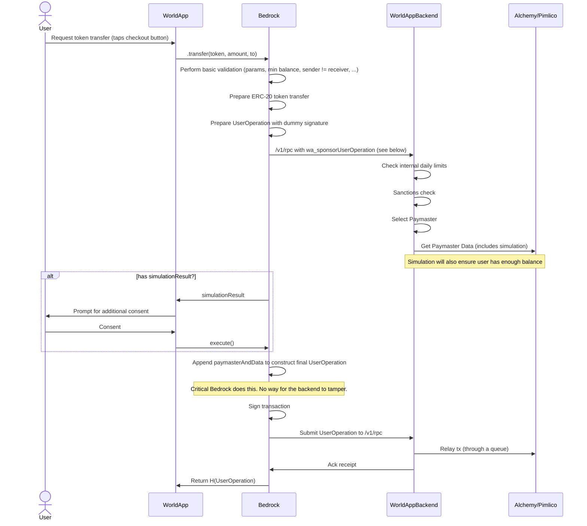

## Definitions

- `UserOperation`: Refers to an ERC-4337 [UserOperation](https://docs.erc4337.io/).

## V1 Technical Details

### High-level Overview

**What we support:**

- All transactions crafted client-side through Bedrock.
- All main transactions in World App that require a user signature will use ERC-4337 for all users.

**How?**

1. A **World App RPC** endpoint in our backend processes whitelisted `UserOperation`s, routing them to our RPC providers. It behaves similarly to a standard Ethereum JSON-RPC, supporting `eth_sendUserOperation`, and exposes a custom sponsorship method.

2. World App (through Bedrock) exposes methods to craft transactions for supported operations. Crafted transactions are signed client-side and submitted to the World App RPC endpoint.

### World App RPC

1. The _World App RPC_ is an authenticated endpoint that aligns with Ethereum JSON-RPC conventions and supports `eth_sendUserOperation`.
2. Initially, only whitelisted operations are accepted; other operations are rejected.
3. Following existing patterns, only Mini App transactions are additionally simulated via `wa_sponsorUserOperation` to analyze common attack vectors.
   1. When a simulation is run, results are presented to the user, who must confirm before the transaction is signed and relayed.
   2. **Why only Mini App transactions?** Other operations are hard-coded in Bedrock; outcomes are deterministic and already displayed in the checkout UI.

#### SponsorUserOperation

To request TFH sponsorship and fully craft an ERC-4337 `UserOperation`, the RPC exposes `wa_sponsorUserOperation`. It returns paymaster data and gas parameters (e.g., `paymaster`, `paymasterData`, `preVerificationGas`, `verificationGasLimit`, `callGasLimit`, fee caps). Bedrock appends `paymasterAndData` client-side before signing and submission.

### Nonces

With ERC-4337, nonce handling is more flexible. World App transactions define unique nonces per operation while using a `0` sequence for most flows. This reduces latency (no extra on-chain nonce read) and allows safe parallelism.

This is how nonces are constructed (following [RIP-7712](https://docs.erc4337.io/core-standards/rip-7712)):

To mitigate users accidentally submitting duplicate transactions during high congestion (e.g., Alice pays Bob $1, realizes the transaction is pending after a few minutes, gets frustrated and submits a second $1 payment; when gas fees drop, both transactions execute), we take the following actions:

1. When fees are high, a **warning** message informing users of network congestion and explaining potential delays and ETAs is automatically shown on:
   1. The wallet home screen
   2. All checkout screens
2. The app detects potential undesired duplicates by checking pending transactions and shows a modal warning when similar actions are already queued:
   1. If the user attempts another transfer to the same destination address.
   2. If the user attempts a swap in the same route.
   3. If the user attempts any transaction to the same Mini App.
   4. If the user attempts another off-ramp operation.
