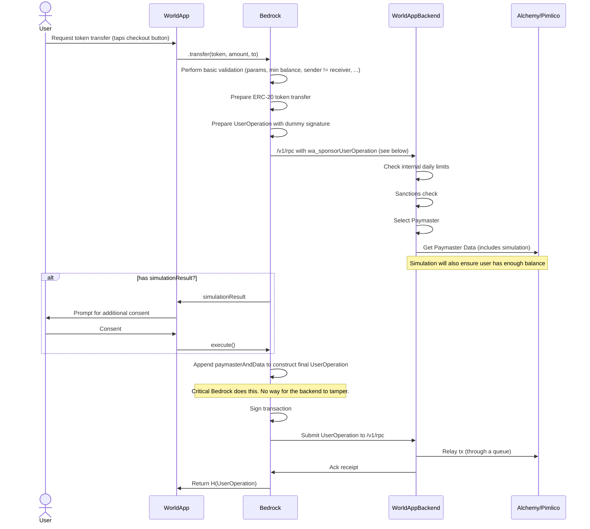

title: "Client-side Transactions"
description: "Spec for client-side transaction architecture, World App RPC, nonce layout, and wallet readiness."

---

## Target End State

1. All transactions originate client-side and can be submitted through the authenticated World App RPC.
2. Users can pick a paymaster or opt to pay their own gas.
3. Transaction metadata exposed by the app backend is sourced from an on-chain indexer rather than custom DB rows.
4. No on-chain operation needs backend-specific handling or trust; Bedrock fully operates calldata/signatures.
5. Importing Safe wallets deployed elsewhere is conceptually possible.

## Technical Details

### Definitions

- `UserOperation`: an ERC-4337 [UserOperation](https://docs.erc4337.io/).

### Supported Flows

- Bedrock crafts every user-signature transaction client-side; vault withdraw, wallet deployment, and OP migration may temporarily follow legacy flows while we finalize gas-cost tradeoffs.
- ERC-4337 becomes the default for all users, so there is one path for crafting and submitting transactions.

### Architecture Overview

1. A **World App RPC** endpoint in the backend processes whitelisted `UserOperation`s, routes them to our providers, and supports both `eth_sendUserOperation` and a sponsorship helper.
2. World App uses Bedrock helpers (for transfers, swaps, mini apps, etc.) to build calldata, sign locally, and submit to `/v1/rpc`.


```mermaid
sequenceDiagram
	actor User
  User->>WorldApp: Request token transfer (taps checkout button)
  WorldApp->>Bedrock: .transfer(token, amount, to)
  Bedrock->>Bedrock: Perform basic validation (params, min balance, sender != receiver, ...)
  Bedrock->>Bedrock: Prepare ERC-20 token transfer
  Bedrock->>Bedrock: Prepare UserOperation with dummy signature
  Bedrock->>WorldAppBackend: /v1/rpc with wa_sponsorUserOperation (see below)
  WorldAppBackend->>WorldAppBackend: Check internal daily limits
  WorldAppBackend->>WorldAppBackend: Sanctions check
  WorldAppBackend->>WorldAppBackend: Select Paymaster
  WorldAppBackend->>Alchemy/Pimlico: Get Paymaster Data (includes simulation)
  Note over WorldAppBackend,Alchemy/Pimlico: Simulation will also ensure user has enough balance
  alt has simulationResult?
   Bedrock->>WorldApp: simulationResult
   WorldApp->>User: Prompt for additional consent
	 User ->> WorldApp: Consent
	 WorldApp ->> Bedrock: execute()
  end
  Bedrock->>Bedrock: Append paymasterAndData to construct final UserOperation
  Note over Bedrock: Critical Bedrock does this. No way for the backend to tamper.
  Bedrock->>Bedrock: Sign transaction
  Bedrock->>WorldAppBackend: Submit UserOperation to /v1/rpc
  WorldAppBackend->>Alchemy/Pimlico: Relay tx (through a queue)
  WorldAppBackend->>Bedrock: Ack receipt
  Bedrock->>WorldApp: Return H(UserOperation)
```

### World App RPC

1. `/v1/rpc` is authenticated, mirrors Ethereum JSON-RPC conventions.
2. Only whitelisted operations are relayed in V1; requests outside that list are rejected.
3. Mini App submissions use a simulation step during sponsorship (see below) so the user can confirm results; Bedrock-native flows skip extra simulation because calldata is deterministic and already surfaced in the checkout UI.

Example payload:

```json
POST /v1/rpc
{
  "jsonrpc": "2.0",
  "id": "tx_<random_bytes>",
  "method": "eth_sendUserOperation",
  "params": [
    {
      "sender": "0x...",
      "nonce": "0x626472636b...",
      "factory": "0x...",
      "factoryData": "0x...",
      "callData": "0x...",
      "callGasLimit": "0x13880",
      "verificationGasLimit": "0x60B01",
      "preVerificationGas": "0xD3E3",
      "maxPriorityFeePerGas": "0x3B9ACA00",
      "maxFeePerGas": "0x7A5CF70D5",
      "paymaster": "0x...",
      "paymasterVerificationGasLimit": "0x0",
      "paymasterPostOpGasLimit": "0x0",
      "paymasterData": null,
      "signature": "0x...",
      "eip7702Auth": { "address": "0x...", "chainId": "0x1", "nonce": "0x1", "r": "0x...", "s": "0x...", "v": "0x1b" }
    },
    "0x0000000071727De22E5E9d8BAf0edAc6f37da032"
  ]
}
```

- The second parameter is the EntryPoint contract.
- `eip7702Auth` is optional but accepted so we can submit to 7702-enabled networks without rejecting extra authorization data.
- Backends persist pending transactions today (queue + DB) but will defer to the shared indexer once it lands.
- Native apps add a `provider-name` header (`any`, `alchemy`, or `pimlico`) so `/v1/rpc/{network}` can steer sponsorship and relaying to a specific bundler if needed.
- We expose `wa_getUserOperationReceipt` to retrieve high-level status (`pending`, `error`, `mined_success`, `mined_revert`) and metadata such as `sourceId`, `selfSponsorToken`, `selfSponsorAmount`, and `transactionHash` once available. This replaces one-off `/status` endpoints per transaction type.

### `wa_sponsorUserOperation`

- Invoked via `wa_sponsorUserOperation` on `/v1/rpc` to fetch paymaster data, updated gas limits, and provider metadata before Bedrock finalizes the `UserOperation`.
- Backend selects between our paymaster providers (Alchemy, Pimlico, etc.), requests sponsorship data, and receives a simulation result that also guards against low balances.
- An optional third param `{ token: <address> }` lets clients request **self-sponsored** gas by identifying which ERC-20 they plan to spend; backend responds with `fee.token`/`fee.amount` describing that path.
- Mini App sponsorship also runs a provider simulation; results are forwarded to World App so the user can explicitly consent before signing.
- Response fields include: `paymaster`, `paymasterData`, `preVerificationGas`, `verificationGasLimit`, `callGasLimit`, `paymasterVerificationGasLimit`, `paymasterPostOpGasLimit`, `maxPriorityFeePerGas`, `maxFeePerGas`, `providerName`, and a fee descriptor (e.g., `{ token: "ETH", amount: "0", reason: "disabled" }`).
- Bedrock appends `paymasterAndData`, signs locally, and replays the send: the backend cannot tamper with calldata between sponsorship and submission.

Example:

```json
{
  "jsonrpc": "2.0",
  "result": {
    "paymaster": "0x0000000000000039cd5e8aE05257CE51C473ddd1",
    "paymasterData": "0x01000066d1...",
    "preVerificationGas": "0x350f7",
    "verificationGasLimit": "0x501ab",
    "callGasLimit": "0x212df",
    "paymasterVerificationGasLimit": "0x6dae",
    "paymasterPostOpGasLimit": "0x706e",
    "maxPriorityFeePerGas": "0x3B9ACA00",
    "maxFeePerGas": "0x7A5CF70D5",
    "providerName": "alchemy",
    "fee": { "token": "ETH", "amount": "0", "reason": "disabled" }
  },
  "id": "tx_<random_bytes>"
}
```

### Nonces & `nonceKey`

- With ERC-4337 we avoid sequential Safe nonces and instead follow [RIP-7712](https://docs.erc4337.io/core-standards/rip-7712), using `0` for the sequence while encoding uniqueness into a 24-byte `nonceKey`.
- Format (all fields `big-endian`):

| Offset | Size | Field         | Description                                                                                                     |
| ------ | ---- | ------------- | --------------------------------------------------------------------------------------------------------------- |
| 0      | 1 B  | `typeId`      | Stable [`TransactionType`](https://github.com/worldcoin/bedrock/blob/main/bedrock/src/smart_account/nonce.rs#L18) enum (1–255). `0x00` reserved for legacy v0 nonces.                                    |
| 1–5    | 5 B  | `magic`       | Constant `0x626472636b` (`"bdrck"`). Distinguishes Bedrock-built operations; collision probability $P = \frac{1}{2^{40}} ≈ 9.1 × 10^{-13}$. |
| 6      | 1 B  | `instruction` | Reserved bitfield (currently `0`). Used later by the indexer.                                                   |
| 7–16   | 10 B | `subtype`     | Transaction-type metadata (e.g., first 10 bytes of hashed `miniAppId`). Parsed per `typeId`.                    |
| 17–23  | 7 B  | `random`      | 56 bits of entropy; collision risk for 1M tx in a bucket $P = \frac{n^2}{2^{57}} = \frac{(10^6)^2}{2^{57}} \approx 0.0007\%$.                                             |

- If `magic` is missing, the indexer treats the transaction as external/unknown and falls back to legacy parsing.
- `TransactionType` ordering must never change; add new IDs at the tail.

### Duplicate-mitigation UX

- High network fees trigger an automatic warning on the wallet home and all checkout surfaces with ETA guidance.
- Bedrock inspects pending transactions and warns the user if a similar action is already queued:
  - Second transfer to the same destination
  - Another swap over the same route
  - Any transaction toward the same Mini App
  - Duplicate off-ramps

### Wallet Upgrades

- Safe accounts must be on Safe v1.4.0 with the 4337 module enabled; otherwise, `wa_sponsorUserOperation` simulations revert.
- On every app launch we call `/world-chain`, which returns `requiresUpgrade`. If `true`, the UI blocks until the user runs the combined Safe upgrade + 4337 module enablement flow.
